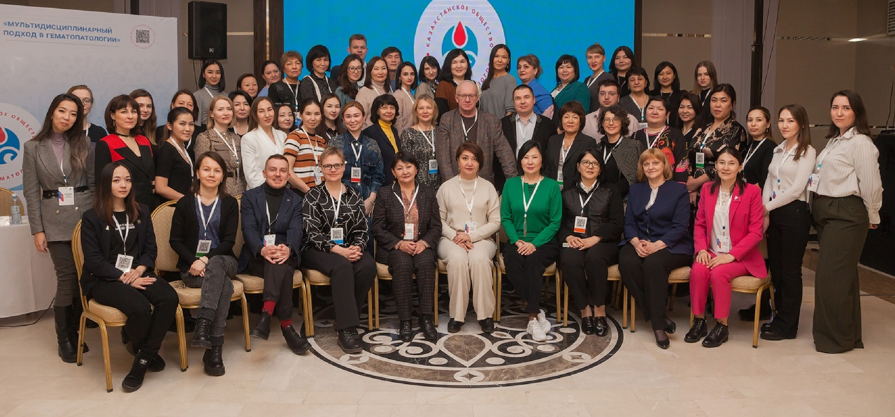
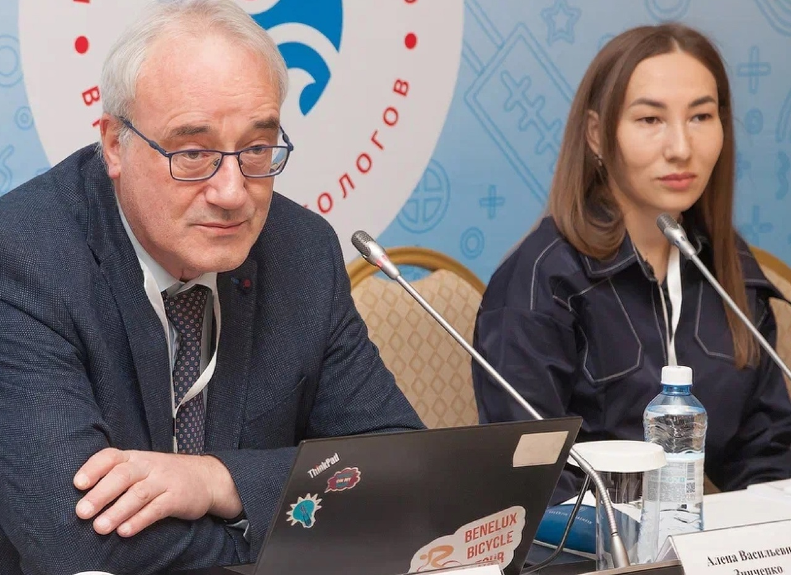

Бірнеше сөзбен айтқанда, бұл — Гематология орталығы қызметкерлері қатысқан ауқымды ғылыми-тәжірибелік конференция.

===

«Гематопатологиядағы мультидисциплинарлық тәсіл» — дәл осылай аталған екі күндік конференцияны «Қазақстан гематолог-дәрігерлер қоғамы» РҚБ ұйымдастырды. Оған Қазақстанның түкпір-түкпірінен келген 130 гематолог, патолог және нефролог қатысты. Бұл тек офлайн қатысушылар саны, оған қоса келе алмағандар онлайн форматта қосылды. Іс-шараның құрметті қонағы Санкт-Петербург мемлекеттік медицина университетінің патологиялық анатомия кафедрасының уақытша меңгерушісі, медицина ғылымдарының докторы, профессор Вадим Валентинович Байков болды. Ол спикерлер пулына жетекшілік етті. Спикерлер қатарында Қазақстанның штаттан тыс бас гематологы Вадим Матвеевич Кемайкин, «Қазақстандық онкогематолог-дәрігерлер кәсіби қоғамы» ҚҚ президенті Райгүл Мұқанбетқызы Рамазанова, сондай-ақ «Гематология орталығы» ЖШС басшылығы — бас директор Ирина Алексеевна Пивоварова және медициналық директор Антон Анатольевич Клодзинский болды.

[owl-carousel class="gallery-owl" items=1 margin=10 loop=true autoplay=false lazyLoad=true]

[/owl-carousel]

Бұл РҚБ ұйымдастырған онкогематологиялық ауруларды диагностикалауда мультидисциплинарлық тәсілге арналған екінші шара. Конференция онкогематология мен гематология саласындағы бірқатар маңызды мәселелерді талқылап қана қоймай, клиницистер үшін ерекше форматта өтті: нақты клиникалық жағдайларды талқылауға әрі патологоанатомдар, әрі гематологтар бірге қатысты. Мысалы, гематологтар ұзақ уақыт бойы бақылап жүрген пациенттердің сүйек кемігіндегі гистологиялық көріністі көру мүмкіндігіне ие болды.

Конференцияның тағы бір ерекшелігі — командалық оқыту форматы: қысқа уақыт аралығында дәрігерлер жаңа ақпарат алып қана қоймай, оны дереу тәжірибеде бекітті: талдап, әріптестерімен түрлі клиникалық жағдайларды шешу жолдарын талқылады, ортақ шешім табуға тырысты.

Клиникалық жағдайларды талқылау үшін ұсынған (жекелеген жағдайларда сарапшы ретінде де қатысқан) мамандардың басым бөлігі — Гематология орталығының қызметкерлері, соның ішінде резидент-дәрігерлер. Біздің әріптестер өз тәжірибесімен басқа медицина мекемелерінің қызметкерлерімен бөлісіп, пайдалы ақпарат алды. Мұның бәрі, түптеп келгенде, пациенттердің игілігі үшін қызмет етпек!