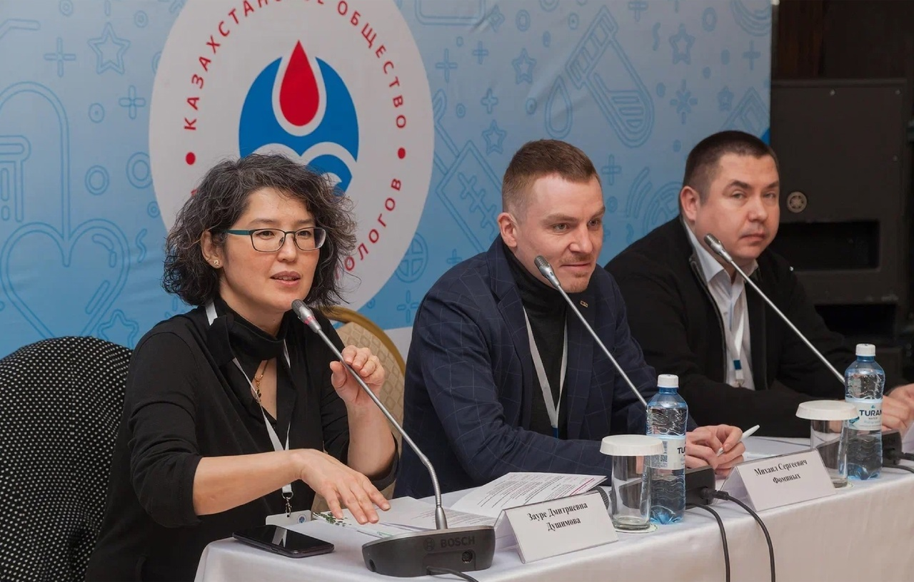

Так в нескольких словах можно описать масштабную научно-практическую конференцию, в которой приняли участие сотрудники Центра гематологии.

===

«Мультидисциплинарный подход в гематопатологии» — это название двухдневной конференции, организованной РОО «Казахстанское Общество врачей-гематологов». Участие в ней приняли 130 гематологов, патологов и нефрологов со всего Казахстана. И это только очно, не считая тех, кто не смог приехать и подключался к участию в онлайн-формате. Почетным гостем мероприятия стал д.м.н., профессор, и.о. заведующего кафедрой патологической анатомии Санкт-Петербургского государственного медицинского университета Вадим Валентинович Байков. Он же возглавил пул спикеров, среди которых были главный внештатный гематолог Казахстана Вадим Матвеевич Кемайкин, президент ОФ «Казахстанское профессиональное общество онкогематологов» Райгуль Муханбетовна Рамазанова и руководство ТОО «Центр гематологии» — генеральный директор Ирина Алексеевна Пивоварова и медицинский директор Антон Анатольевич Клодзинский.  

[owl-carousel class="gallery-owl" items=1 margin=10 loop=true autoplay=false lazyLoad=true]

[/owl-carousel]

Это уже второе мероприятие, ориентированное на мультидисциплинарный подход в диагностике онкогематологических заболеваний, которое организует РОО. Конференция не только позволила рассмотреть ряд важных вопросов в области онкогематологии и гематологии, но еще и была проведена в интересном для клиницистов формате: в обсуждении конкретных клинических случаев участвовали и патологи, и гематологи. К примеру, гематологам предоставлялась возможность увидеть гистологическую картину в костном мозге у тех пациентов, которых они ведут в течение длительного времени. Еще одной особенностью конференции  стала организация командного обучения: в течение короткого отрезка времени врачи не только получали новую информацию, но могли ее тут же закрепить на практике: проанализировать, обсудить с коллегами пути решения разных клинических задач, попробовать найти общее решение.

Представляли клинические случаи для разбора (а в отдельных случаях выступали в качестве экспертов) в основном сотрудники Центра гематологии, в том числе и врачи-резиденты. Наши коллеги поделились своим опытом с сотрудниками других медучреждений и получили полезную информацию. И все это в итоге будет работать на благо пациентов!