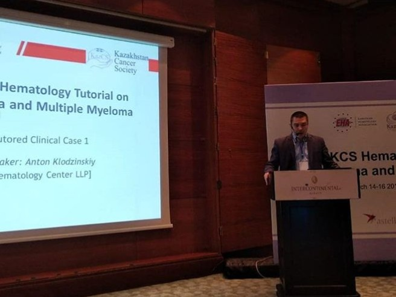

14-16 марта 2019 года в Алматы произошло важное для казахстанской гематологии событие — первый [European Hematology Association Tutorial](https://ehaweb.org/organization/newsroom/news-and-updates/eha-leads-tutorial-in-kazakhstan-for-better-understanding-of-lymphomas/) в Казахстане, в котором с докладами приняли участие наши доктора.

[owl-carousel class="gallery-owl" items=1 margin=10 loop=true autoplay=false lazyLoad=true]

[/owl-carousel]