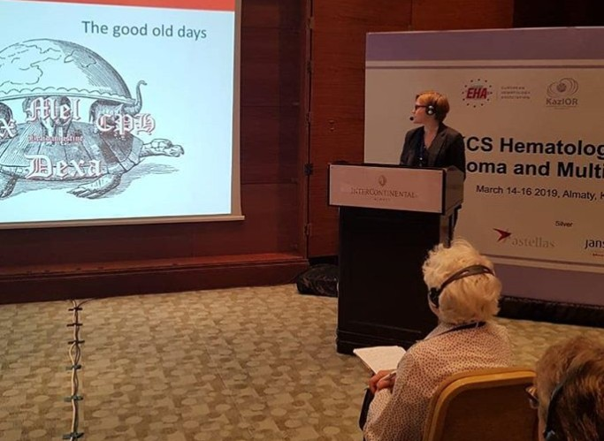

2019 жылғы 14–16 наурызда Алматыда қазақстандық гематология үшін маңызды оқиға өтті — Қазақстандағы алғашқы [European Hematology Association (EHA) Tutorial](https://ehaweb.org/organization/newsroom/news-and-updates/eha-leads-tutorial-in-kazakhstan-for-better-understanding-of-lymphomas/). Іс-шараға біздің дәрігерлер баяндама жасап қатысты.

[owl-carousel class="gallery-owl" items=1 margin=10 loop=true autoplay=false lazyLoad=true]

[/owl-carousel]