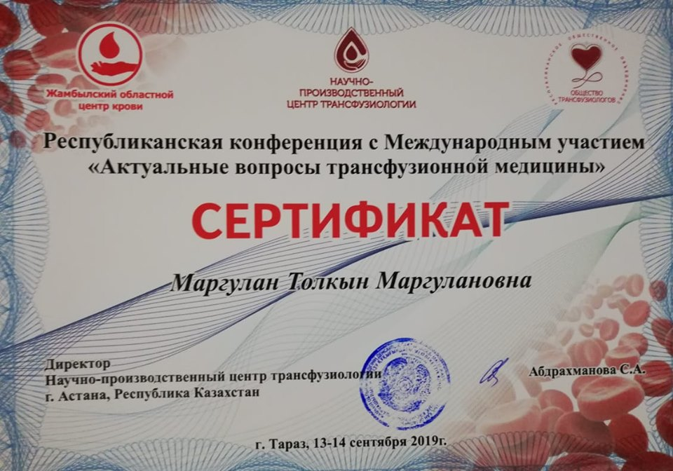

Karaganda Medical University is one of the few universities offering a residency program in hematology (at the Department of Internal Medicine No. 2; clinical base — Hematology Center LLP).

===

[owl-carousel class="gallery-owl" items=1 margin=10 loop=true autoplay=false lazyLoad=true]

[/owl-carousel]

Currently, four young doctors are continuing their training. Since last year, with the active involvement and support of the Department of Biochemistry, all residents have been conducting a small research project comparing two methods for assessing red blood cell hemolysis in hemacon containers. This year, they published their results, and Tolkyn Marghulanqyzy presented them in Taraz at the international conference “Topical Issues of Transfusion Medicine”, organized by the Scientific and Production Center of Transfusiology.

For us, this is both an important and joyful event. Hematology, like many other medical specialties, risks turning into mere routine without research, while true progress is only possible with a strong scientific foundation.