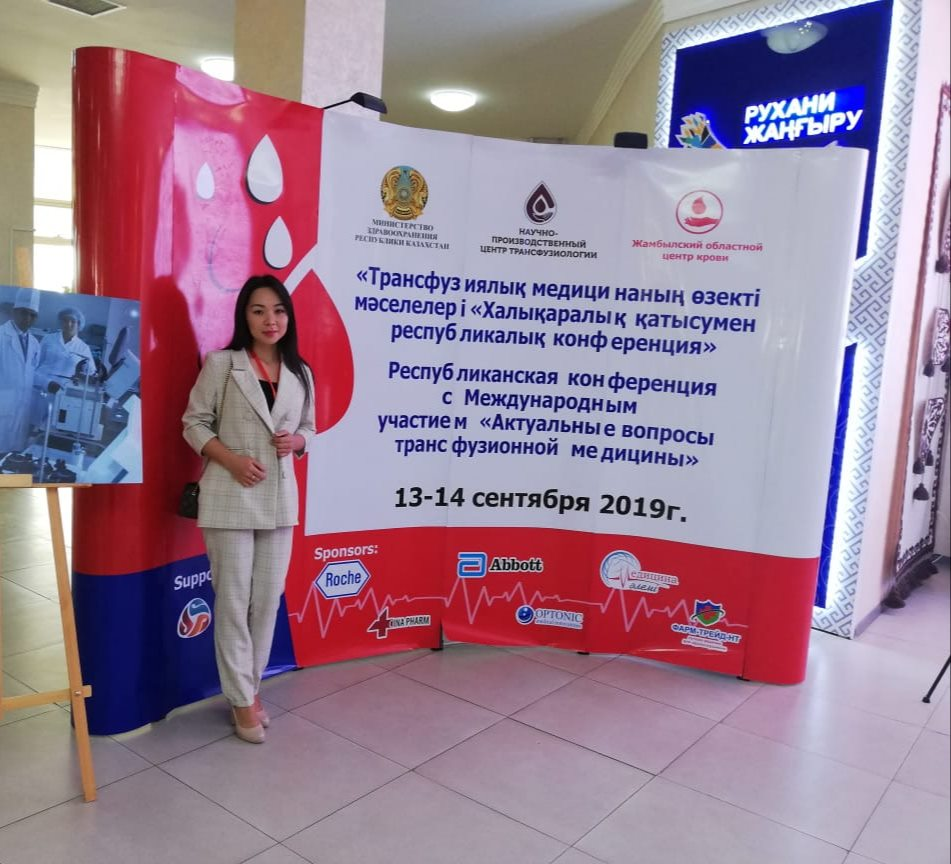

Карагандинский медицинский университет Karaganda Medical University  — один из немногих ВУЗов, где есть резидентура по гематологии (на кафедре внутренних болезней №2; клиническая база — ТОО «Центр гематологии»).

===

[owl-carousel class="gallery-owl" items=1 margin=10 loop=true autoplay=false lazyLoad=true]

[/owl-carousel]

Сейчас продолжают обучение 4 молодых доктора. Все резиденты с прошлого года при активном участии и помощи кафедры биохимии проводили небольшое исследование по сравнению двух методов оценки гемолиза эритроцитов в гемаконах, в этом году опубликовали результаты, и Толқын Марғұланқызы доложила их в Таразе на конференции с международным участием «Актуальные вопросы трансфузионной медицины», организованной Научно-Производственным Центром Трансфузиологии.

Для нас это важное и радостное событие. Гематология, как и многие другие медицинские специальности в отрыве от исследований превращается в ремесло, а прогресс возможен только при значительной научной составляющей.