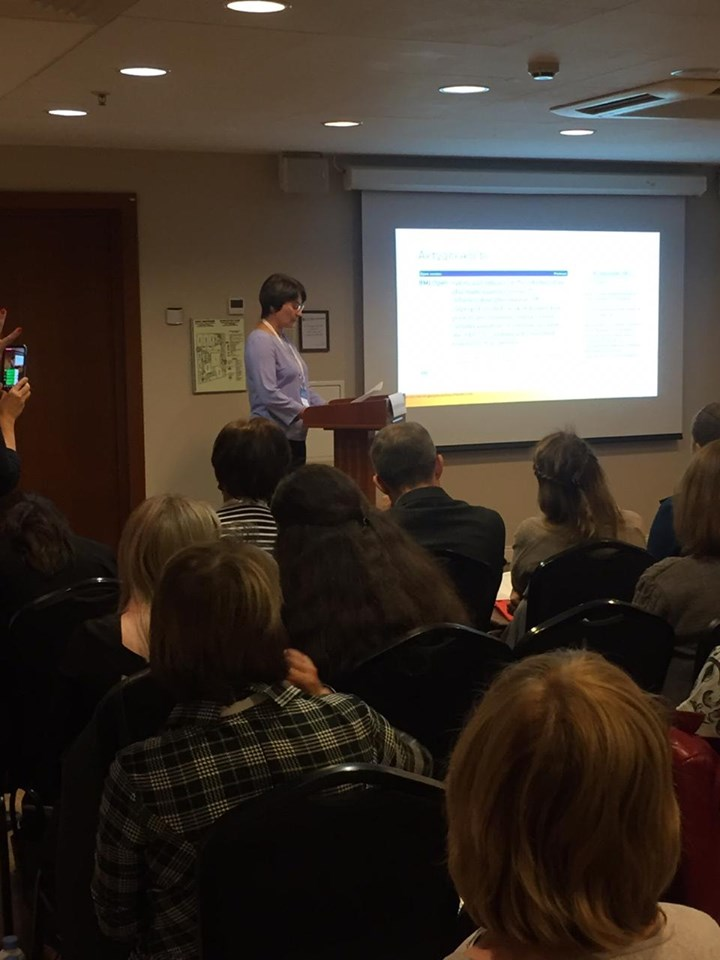
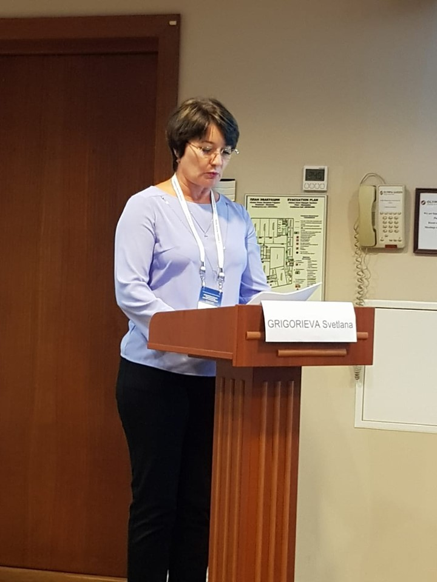

Staff of the Center took part in the 13th International Symposium “Hematopoietic Stem Cell Transplantation. Gene and Cell Therapy”, dedicated to the memory of R. M. Gorbacheva, held in St. Petersburg.

===

[owl-carousel class="gallery-owl" items=1 margin=10 loop=true autoplay=false lazyLoad=true]

[/owl-carousel]

For the second year in a row, our nurses presented at the nursing section of the symposium. Svetlana Grigorieva spoke about the results of the third stage of a study aimed at selecting the optimal antiseptic for central venous catheter care in hematology patients.