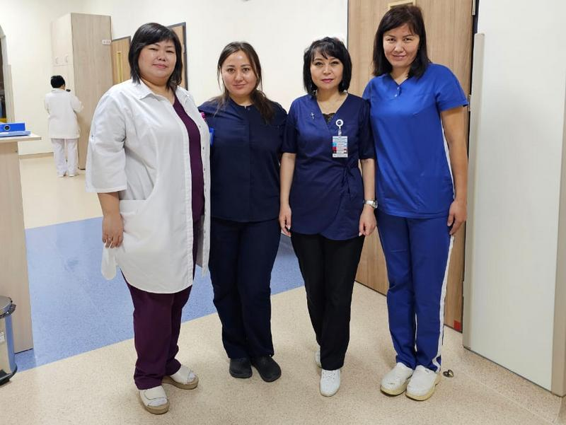
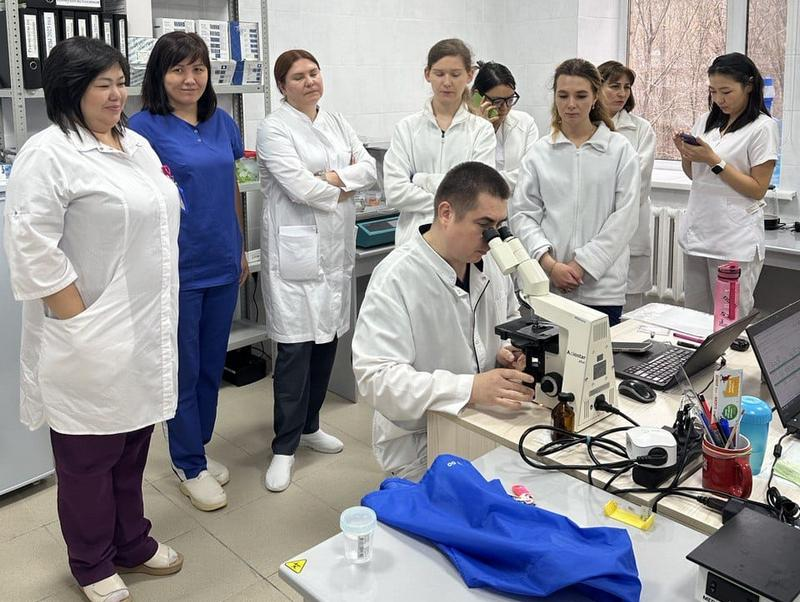
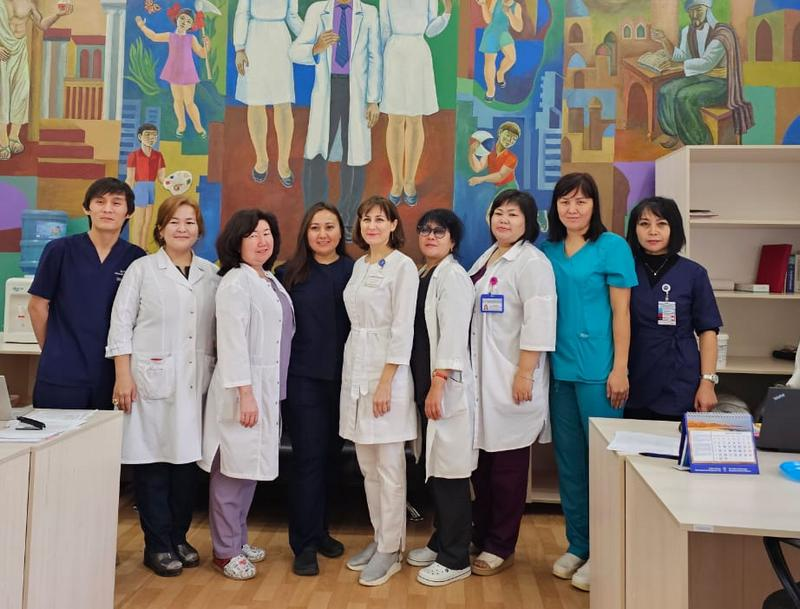
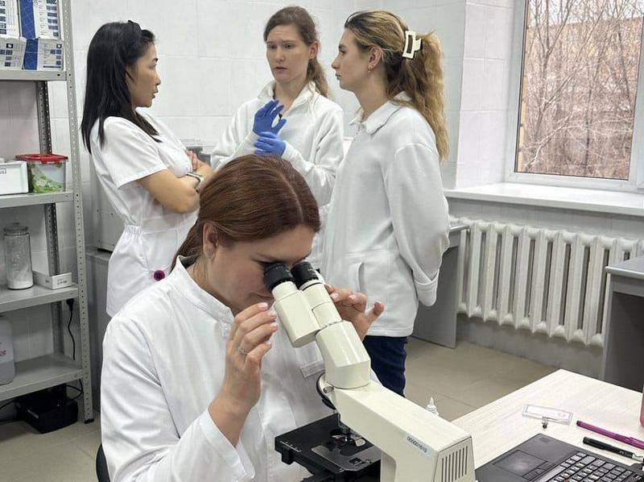
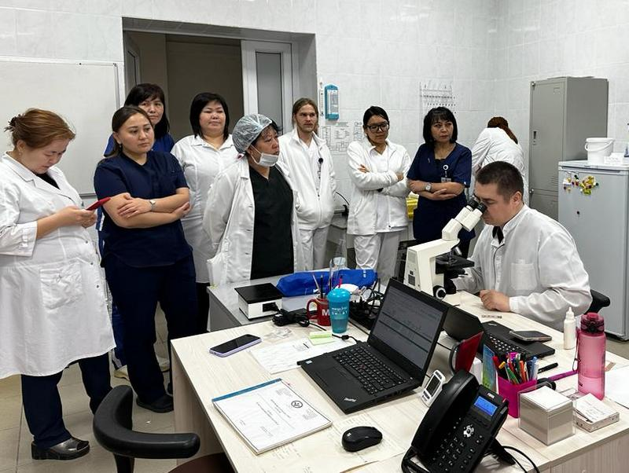

Karaganda, November 23, 2023 — Today marked the conclusion of an experience-sharing program for healthcare professionals dedicated to the diagnosis and treatment of chronic myeloproliferative neoplasms (MPNs). The program, hosted at the Karaganda Branch of the Hematology Center (17 Saken Seifullin Avenue), was held from November 21 to 23, 2023.

===

During the event, participants updated their knowledge on trephine biopsy techniques, interpretation of pathomorphological and molecular genetic study results, and the use of diagnostic scales. The program also included practical aspects of implementing the MPN-10 questionnaire in routine clinical practice. The curriculum featured lectures, interactive workshops, and practical sessions with case-based discussions and situational tasks.

The aim of the event was to enhance clinical practice in the management of patients with myeloproliferative neoplasms.

The program was designed for hematologists and covered a broad range of topics related to the diagnosis and management of MPNs. A total of 12 specialists participated from various cities, including Aktobe, Petropavlovsk, Semey, Pavlodar, Taldykorgan, Almaty, Astana, and Ust-Kamenogorsk.

The event was organized with the support of Novartis Pharma Services AG Branch in the Republic of Kazakhstan.

[owl-carousel class="gallery-owl" items=1 margin=10 loop=true autoplay=false lazyLoad=true]

[/owl-carousel]