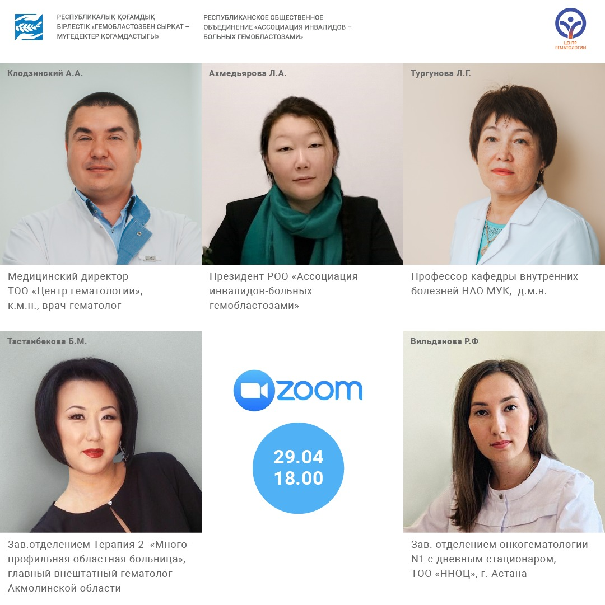

ТОО «Центр гематологии» приглашает стать участником очередной виртуальной школы пациента. Все, кто желает узнать как можно больше о миелофиброзе и истинной полицитемии, смогут 29 апреля присоединиться к нам в ZOOM!

===

Опытные врачи-гематологи расскажут о том, что такое миелофиброз, как он проявляется, поведают о причинах возникновения заболевания, факторах риска, особенностях образа жизни пациентов, диагностике и лечении на ранних и поздних этапах заболевания. Во второй части школы будет дана не менее подробная информация о причинах возникновения и проявления истинной полицитемии, влиянии факторов риска на течение заболевания и т.д.

Для тех, кому нужно узнать, как лучше ориентироваться в получении поддержки государства, полезным будет выступление президента республиканского общественного объединения «Ассоциация инвалидов-больных гемобластозами Л.А. Ахмедьяровой. Тема его – социальные вопросы защиты людей с миелофиброзом и истинной полицитемией.

У тех, кто станет участником виртуальной школы, будет возможность не только получить полезную информацию, но и задать спикерам вопросы в рамках заявленных тем. Присоединяйтесь к нам в ZOOM! Начало школы – 29 апреля, 18.00 по времени Алматы.

Подключиться к конференции Zoom можно будет по [ссылке](https://us02web.zoom.us/j/81790724622?pwd=Zjd4YXBaeENldzdHZn%E2%80%A6#success)

Идентификатор конференции: 817 9072 4622

Код доступа: 901622

Участие бесплатное! Ждем вас!