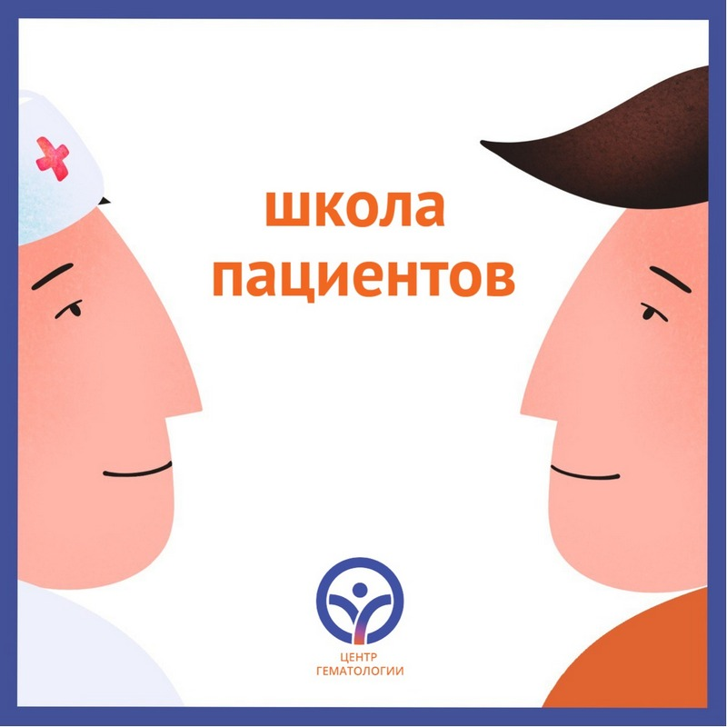

Белгіленген тақырыптар аясында мектептердің мазмұнын тыңдармандардың өздері айқындай алады: сұрақтарыңызды алдын ала жіберіңіздер. Біздің мақсатымыз – сіздермен бірге, сіздер үшін үйрену және өзгеру!

===

Жаңа формат несімен ерекшеленеді?

Бұрын пациент мектебінің тек тақырыптары ғана емес, ішкі мазмұны да алдын ала жоспарланатын. Тәжірибелі гематологтар аурулардың пайда болу себептері, көріністері, диагностикасы, емдеу тәсілдері, қауіп факторлары және пациенттің өмір салты туралы жан-жақты баяндамалар әзірлейтін. Жаңа форматта ішкі мазмұнды қалыптастыруға сіздердің сұрақтарыңыз көмектеседі. Әрине, негізгі жайттар туралы мамандарымыз міндетті түрде айтады, бірақ біз лекторий үлгісінен сәл шегінуді жоспарлап отырмыз.

Біз сіздерге шынымен маңызды сұрақтарды қою мүмкіндігі болғанын қалаймыз. Сұрақтарыңыздың негізінде біз қандай мәселелерге көбірек көңіл бөлу керегін түсінеміз: мүмкін, сіздерге емдеу кезеңдері мен бейімділік туралы егжей-тегжейлі түсіндірме қажет шығар; немесе диагностика ерекшеліктері, пациенттің өмір салты, тамақтану тәртібі және т.б. көбірек қызықтыратын болар.

Нақтылаймыз: мектеп жеке консультацияны алмастырмайды. Нақты пациентке ем таңдау туралы сұрақтарды жіберудің қажеті жоқ. Дәрігерлердің сөз сөйлеулері негізгі сауалдарды ескере отырып құрылып, көпшілікке пайдалы болатындай етіп дайындалады.

Жаңа форматтағы бірінші мектеп 19 мамыр күні өтеді. Тақырыбы – көптік миелома.
Келесі шығарылым 9 маусымға жоспарланған. Тақырыбы – созылмалы лимфолейкоз.

Сұрақтарыңызды алдын ала patient@hemcenter.kz
 поштасына немесе Пациенттерді қолдау қызметінің WhatsApp нөміріне: +7 777 079 3165 жіберіңіздер. Ал 19 мамыр және 9 маусым күндері ZOOM платформасындағы виртуалды мектептерге қосылыңыздар! Сілтемелер кейінірек жарияланады.