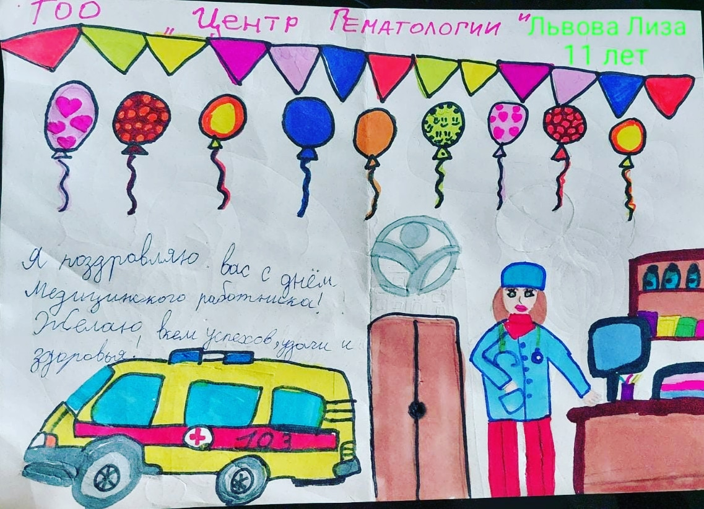
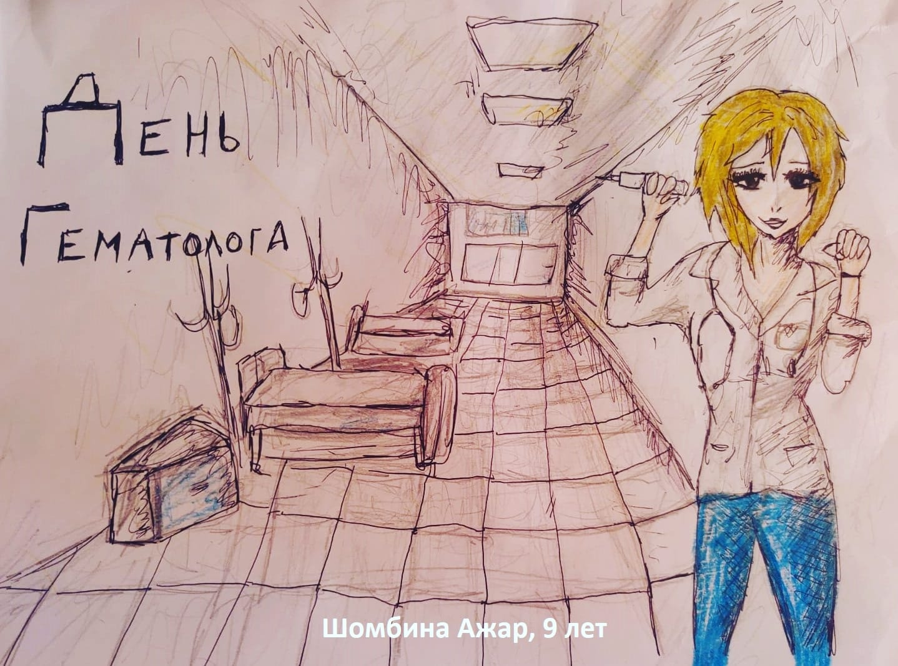
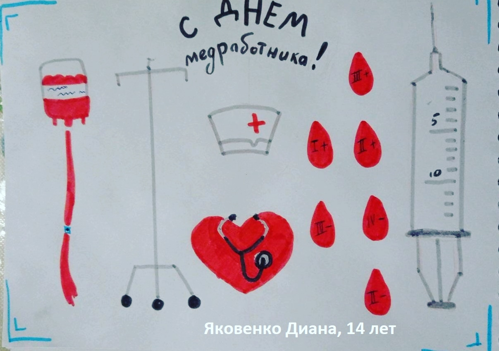
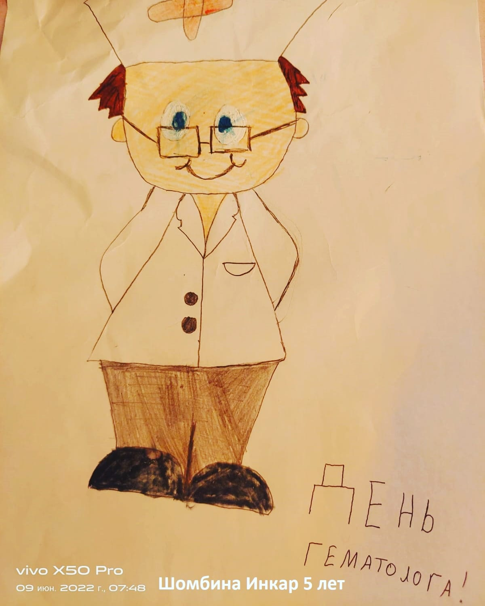
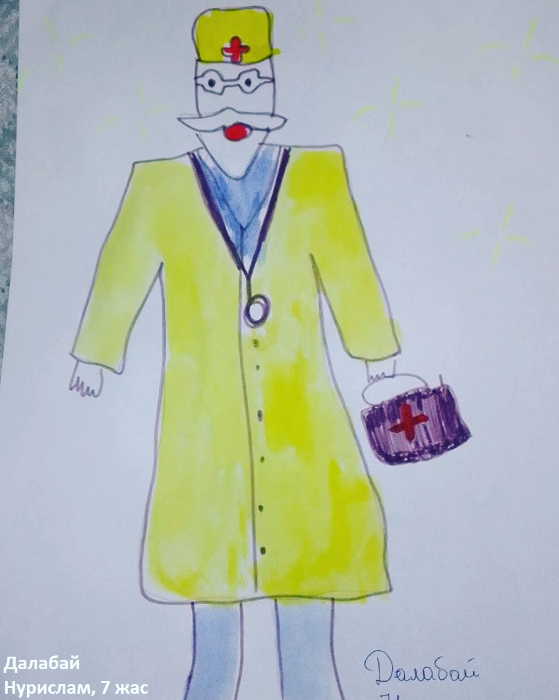

Медицина қызметкері күніне орай «Гематология орталығында» ашық хаттар байқауы өтті. Ашық хаттарды ЖШС қызметкерлерінің балалары мен немерелері салды.

===

[owl-carousel class="gallery-owl" items=1 margin=10 loop=true autoplay=false lazyLoad=true]

[/owl-carousel]

Байқауға барлығы жиырма жұмыс ұсынылды. Олардың барлығы ерекше – жылы сезімге толы, шынайы әрі талантты. Балалар тек сурет салып қана қойған жоқ, сонымен бірге көлемді, әсем ашық хаттар мен құттықтау хаттарын жасады. Тіпті медициналық құралдар жинағы бар чемодан пішініндегі ашық хат та болды!

Байқауға «Гематология орталығы» ЖШС қызметкерлерінің балалары мен немерелері қатысты. Сыйлықтарға бірден алты қатысушы ие болды. Олардың үшеуі – Инстаграм әлеуметтік желісіндегі дауыс беру нәтижесі бойынша жеңімпаз атанды. Рейтинг көшбасшысы, 9 жастағы Ажар Шомбіна 459 (!) дауыс жинады, 11 жастағы Лиза Львова-ның суреті 317 дауысқа ие болды. Ал ең жас қатысушы, 5 жастағы Інкар Шомбіна 304 лайк жинады! Үшеуі де – Өскемен қаласының тұрғындары. Олар байқаудың негізгі жүлделерін алады.

Тағы үш жұмыс арнайы жүлделерге ие болды (жюри таңдауы бойынша):

* 7 жастағы Нурислам Далабай (Қарағанды) жасаған харизматикалық дәрігер бейнесі,
* 8 жастағы Рамазан Ералы (Қарағанды) салған шуақты әрі бейбіт ашық хат,
* 14 жастағы Диана Яковенко (Өскемен) дайындаған концептуалды ашық хат.

Барлық қатысушыларға шығармашылығы, жанашырлығы және таланты үшін үлкен алғыс айтамыз!
Әсіресе – ең жарқын құттықтаулар үшін!

Алда келе жатқан кәсіби мерекелеріңізбен, әріптестер! Сау болыңыздар, бақытты болыңыздар!