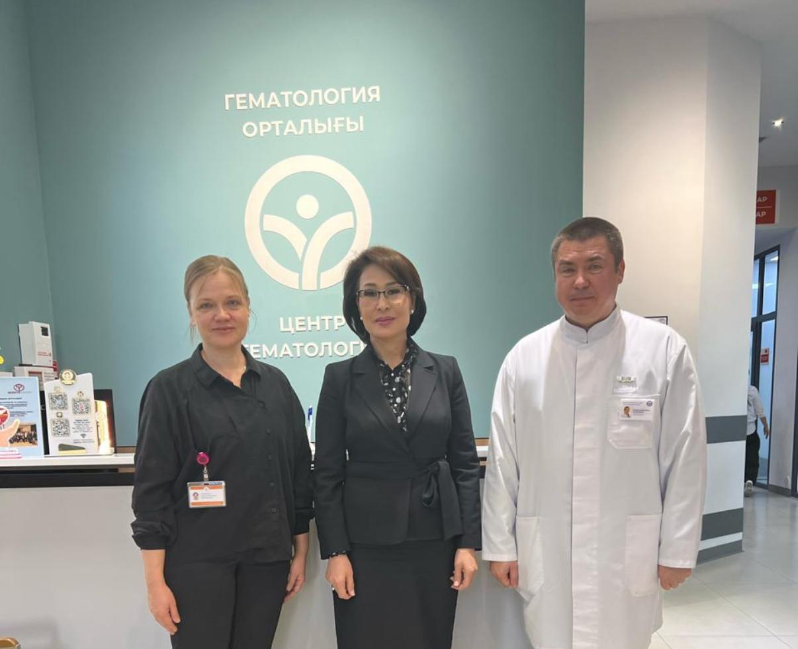
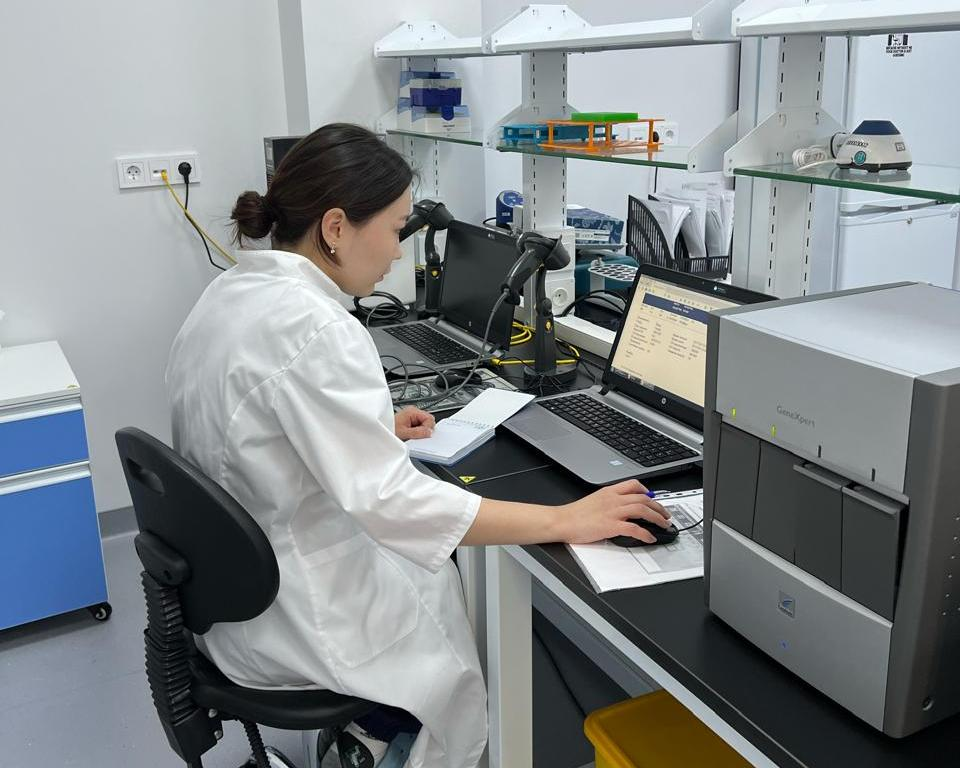
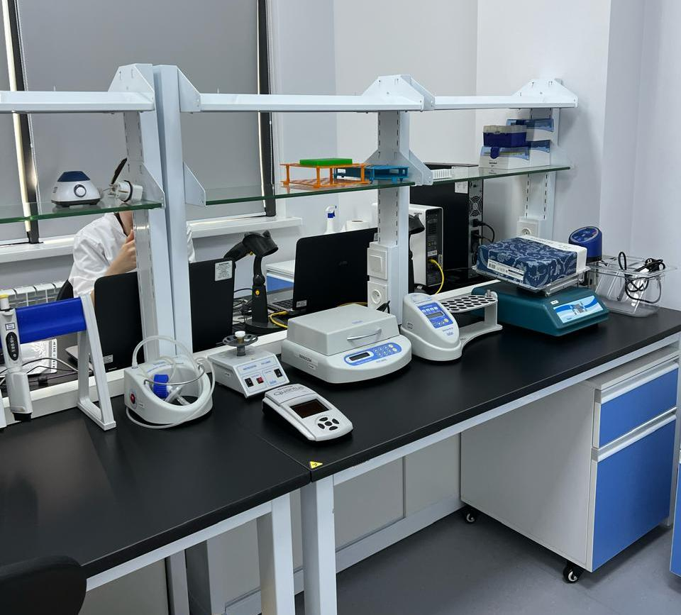
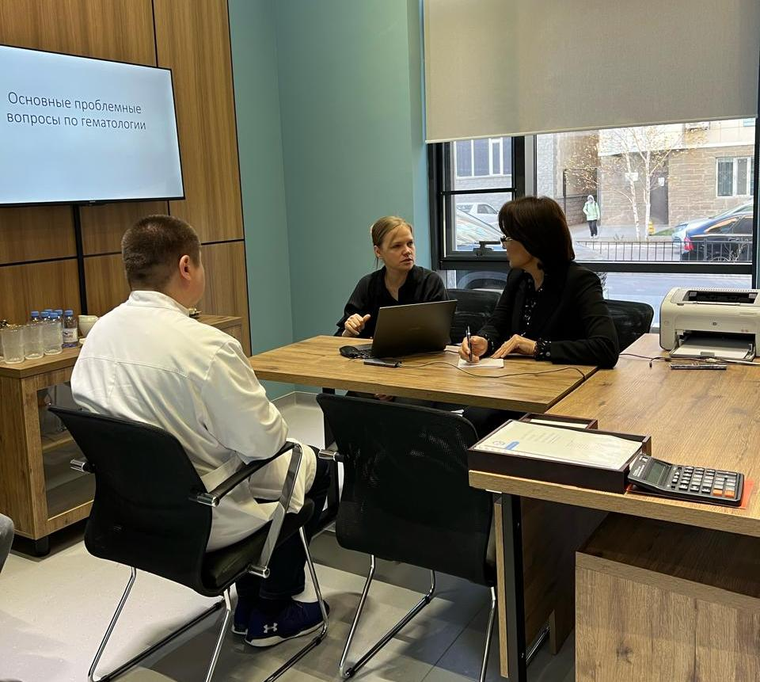
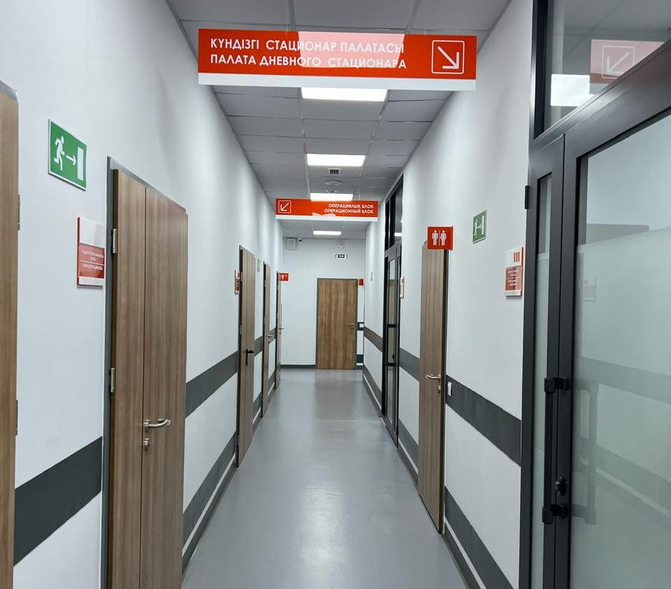

Minister of Health of the Republic of Kazakhstan Akmaral Sharipbaevna Alnazarova visited Hematology Center LLP in Astana.

The Minister met with the founders and leaders of the Center — Irina Pivovarova and Anton Klodzinsky — to discuss in detail the systemic issues related to the development of the hematology service in Kazakhstan.

===

[owl-carousel class="gallery-owl" items=1 margin=10 loop=true autoplay=false lazyLoad=true]

[/owl-carousel]

Over the past 10 years, with the support of the Ministry of Health, the Center has built a sustainable model for providing hematological care to the adult population of the country.

📊 More than 53,000 consultations have been conducted, and 5,608 patients with blood disorders are currently on the dispensary registry.

The network includes branches in Astana, Karaganda, and the East Kazakhstan region.
The total hospital capacity comprises 51 inpatient beds and 34 day hospital beds, in addition to an active outpatient and consulting department.
A particularly high level of digitalization and laboratory development was noted.

The Center hosts localized histological, immunohistochemical, cytogenetic, and cytological studies.
Through telemedicine, rapid access to second opinions from reference centers is ensured, improving diagnostic accuracy and the quality of patient management.

The results are impressive:
✅ Five-year overall survival in chronic myeloid leukemia (BCR-ABL1+) — 91.8%;
✅ in chronic lymphocytic leukemia — 78.4%;
✅ in multiple myeloma — 68.3% (more than double the 31% recorded in 2015).

During the visit, a number of important issues were discussed to improve the accessibility and quality of medical care for patients with hematologic diseases.

Among them:
— transition to a technology-oriented tariff system, including the cost of chemotherapy in the tariffs;
— creation of registries of oncohematology patients to monitor therapy outcomes and quality of life;
— development of outpatient tariffs and prevention of treatment interruptions;
— improvement of care volume planning and drug provision;
— and the phased implementation of the National Hematology Standard, taking into account the readiness of each region.

An agreement was reached to develop a roadmap for implementing these initiatives — from updating the tariff model to scaling up digital solutions and strengthening human resources.

The Minister expressed confidence that the joint efforts of the Ministry of Health, the professional community, and regional centers will bring hematological care in Kazakhstan to a new qualitative level.