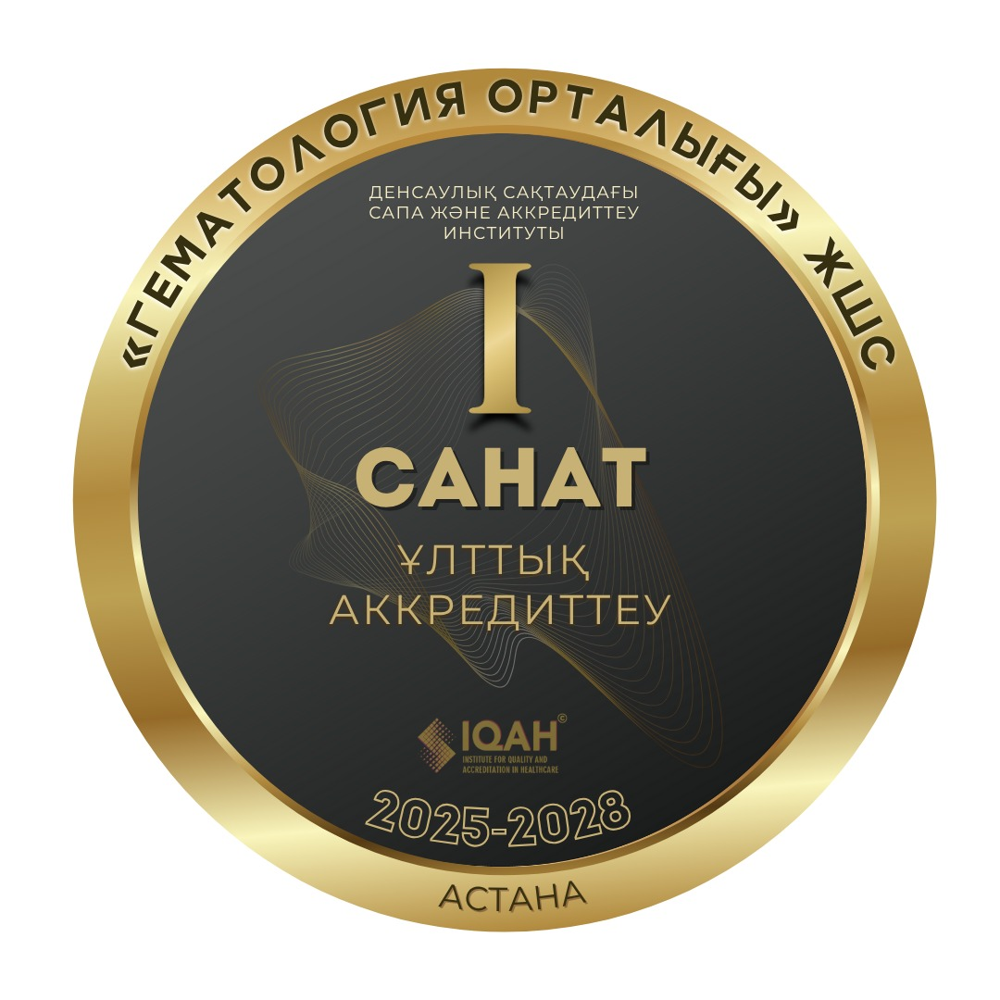

«Гематология орталығы» ЖШС Денсаулық сақтаудағы сапа және аккредиттеу институтының (IQAН) шешімімен 2025–2028 жылдарға арналған ұлттық аккредитацияның I санаты бойынша аккредиттелген ұйым деп танылды.

===

Бұл аккредитация Орталық қызметінің Қазақстан Республикасындағы медициналық көмектің сапасы мен қауіпсіздігіне қойылатын мемлекеттік стандарттарға толық сәйкестігін растайды.
