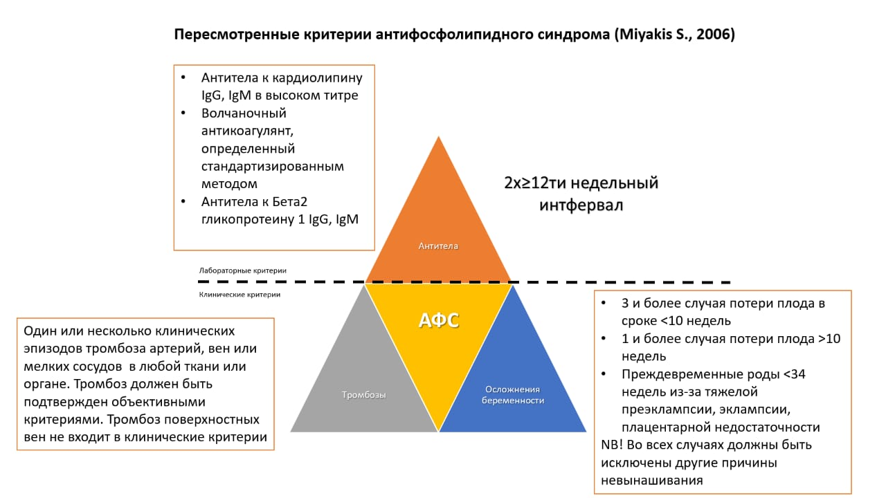

ФОСФОЛИПИДТЕР ЖӘНЕ ОЛАРҒА ҚАРСЫ АНТИДЕНЕЛЕР

Фосфолипидтер жасушалардың беткі қабатын құрайтын мембраналарда болады, оған қан жасушалары мен қан тамырларын қаптайтын эндотелий жасушалары да кіреді. Кейбір адамдарда иммундық жүйе фосфолипидтерге бекітілген белоктарға қарсы антиденелер шығарады.

Антифосфолипидтік антиденелердің болуы:

тамырларда немесе көктамырларда тромб түзілу қаупін арттырады,

жүкті әйелдерде түсік немесе өлі туылу қаупін жоғарылатады.

Алайда кейбір адамдарда мұндай антиденелер болса да, оларда тромбтар немесе түсік болмайды.

Егер антиденелері бар адамның тамырында тромбтар немесе жүктілікке байланысты асқынулар дамыса, мұндай жағдай антифосфолипидтік синдром (АФС) деп аталады.

АФС – аутоиммундық ауру, яғни иммундық жүйе қателесіп, ағзаның сау тіндері мен ағзаларын зақымдайды. Ол көбінесе басқа аутоиммундық немесе ревматикалық аурулары бар науқастарда кездеседі, әсіресе жүйелі қызыл жегіде (СКВ). Егер АФС басқа аурусыз дамыса, оны «біріншілік» АФС деп атайды.

АНТИФОСФОЛИПИДТІК СИНДРОМНЫҢ СИМПТОМДАРЫ

АФС белгілері көбіне қанның ұюындағы бұзылыстармен, түсікпен немесе өлі туумен байланысты.

Тромбоз (қан ұйындысы). Антиденелер көктамырда немесе артерияда тромб түзілу қаупін арттырады. Емделмесе, қайталама тромбтар жиі пайда болады. Тромбтың орналасуына қарай мүшелердің қан айналымы бұзылып, қызметі зардап шегеді.

Миға қан бармауы. Артериядағы тромб қан ағымын бөгеп, қысқа уақытты неврологиялық бұзылыстардан бастап инсультке дейін әкелуі мүмкін.

Бүйрек зақымдануы. Жеңіл дисфункциядан бүйрек жетіспеушілігіне дейін болуы ықтимал.

Терең көктамыр тромбозы (ТКТ). Әдетте аяқтарда пайда болады, бірақ кейде қолдар да зақымдалады. Белгілері – ауырсыну, ісіну. Үлкен тромб жүрек арқылы өкпе тамырларына түсіп, өкпе артериясының тромбоэмболиясына әкелуі мүмкін. Бұл кезде кеудеде ауырсыну, ентігу, кейде қан қақыру болады. Ірі тромб есінен тануға немесе өлімге апаруы мүмкін.

Түсік немесе өлі туу. Жүкті әйелдерде АФС антиденелері бұл қауіптерді арттырады.

Тромбоцитопения. Кейбір науқастарда тромбоциттер саны азаяды. Бұл қан кету қаупін арттырады (мұрыннан, қызыл иектен, теріде петехиялар, асқазан-ішек жолынан, жатырдан). Бірақ АФС кезінде тромбоциттер төмендегеннің өзінде қан кетуден гөрі тромб түзілу қаупі жоғары болуы мүмкін.

Қосымша белгілер: анемия, жүрек қақпақшаларының зақымдануы, тері бөртпелері мен жаралары, есте сақтау проблемалары.

ДИАГНОСТИКА

АФС диагнозы ауру тарихына және лабораториялық зерттеулерге негізделеді. Қажет шарттар:

Тромбоз эпизоды, 10-шы аптадан кейін бір немесе бірнеше түсік, 10 аптаға дейін үш және одан да көп түсік, немесе 34-аптаға дейінгі ерте босану (преэклампсияға байланысты).

Қанда антифосфолипидтік антиденелердің табылуы (кем дегенде 12 апта аралықпен екі рет).

Тесттер:

Қызыл жегі антикоагулянты (ВАК)

Кардиолипинге қарсы антиденелер

Бета-2-гликопротеин I-ге қарсы антиденелер

ПРОФИЛАКТИКА ЖӘНЕ ЕМ

Антикоагулянттар. Бұл препараттар жаңа тромбтардың түзілуін тежейді және бар тромбтардың үлкеюіне жол бермейді. «Қанды сұйылтқыш» деп қате аталады.

Жедел тромбтар кезінде көбіне гепарин немесе төмен молекулалы гепарин (ТМГ) (мысалы, эноксапарин, далтепарин) қолданылады.

Одан кейін ұзақ мерзімді ем үшін варфарин тағайындалады (таблетка түрінде). Гепарин варфарин әсері тұрақтанған соң тоқтатылады.

Варфаринді бақылау.

Дозасы қанның ұю көрсеткіштері бойынша түзетіледі.

Негізгі тест – протромбин уақыты (ПУ) және халықаралық нормаланған қатынас (ХНҚ / INR).

Көп жағдайда мақсатты диапазон – 2–3. INR төмен болса – тромбоз қаупі, жоғары болса – қан кету қаупі артады.

Антиагреганттар.

Кейбір науқастарға аспирин тағайындалуы мүмкін (тромбоциттердің бірігуін тежейді).

Әдетте варфаринді алмастырмайды, бірақ кейде қосымша ретінде қолданылады.

Операция алдындағы ем.

Операция алдында варфарин уақытша тоқтатылады.

Қосымша гепарин қолданылады.

Операциядан кейін 12 сағат ішінде варфаринді қайта бастауға болады.