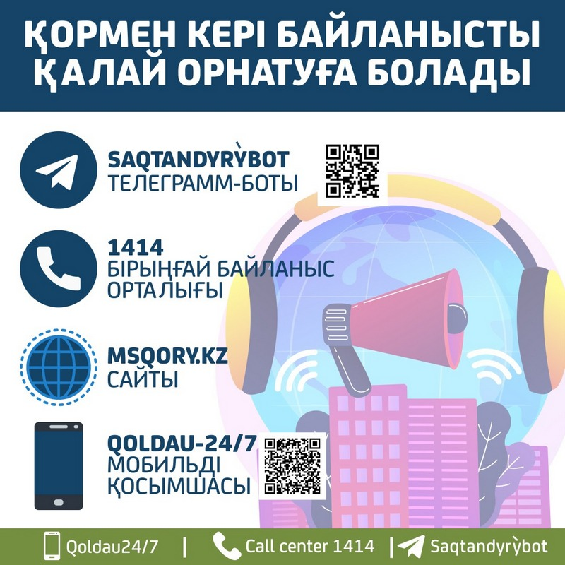

2020 жылғы 1 қаңтардан бастап Қазақстанда Міндетті әлеуметтік медициналық сақтандыру жүйесі күшіне енді.

Сіз сақтандыру бойынша қалай медициналық көмек алатыныңызды және МӘМС жүйесіне қатысу үшін не істеу қажет екенін білесіз бе? Толығырақ білу үшін [fms.kz](https://fms.kz) сайтына кіріңіз немесе 1406 тегін нөміріне қоңырау шалыңыз.

[Медициналық көмекті алу тәртібі](https://adilet.zan.kz/kaz/docs/V1500011361).

Сондай-ақ, өз емханаңызға барып, МӘМС бойынша кеңес ала аласыз.

### ТЕГІН ҚОЛЖЕТІМДІ – ТМККК

Тегін медициналық көмектің кепілдендірілген көлеміне (ТМККК) мыналар кіреді:
* Жедел медициналық көмек, оның ішінде санитарлық авиация;
* Бастапқы медициналық-санитарлық көмек (БМСК), оның ішінде диагностика, емдеу, профилактикалық тексерулер, инфекциялық ауру ошақтарындағы санитарлық-эпидемияға қарсы және санитарлық-профилактикалық іс-шаралар;
* Амбулаториялық жағдайда мамандандырылған медициналық көмек, оның ішінде ВИЧ-инфекциясы мен туберкулездің алдын алу және диагностикасы, шұғыл жағдайларда көрсетілетін қызметтер, әлеуметтік мәні бар және созылмалы ауруларды диагностикалау мен емдеу;
* Стационарды алмастыратын жағдайда мамандандырылған медициналық көмек, оның ішінде әлеуметтік мәні бар және созылмалы ауруларды емдеу; үй стационары қызметтері;
* Стационарлық жағдайда мамандандырылған медициналық көмек, оның ішінде айналадағы адамдар үшін қауіпті жұқпалы және паразитарлық ауруларды, сондай-ақ олардан күдіктенген жағдайларды емдеу;
* Дәрі-дәрмекпен қамтамасыз ету, оның ішінде медициналық бұйымдар, иммунобиологиялық препараттар жедел және мамандандырылған көмек кезінде, сондай-ақ БМСК аясында профилактикалық екпелер жүргізілетін және амбулаториялық жағдайда көрсетілетін мамандандырылған көмек бойынша аурулардың тізбесіне сәйкес.

### ТЕГІН ҚОЛЖЕТІМДІ – МӘМС

МӘМС жүйесінде сақтандырылған мәртебесі бар адамдар міндетті әлеуметтік медициналық сақтандыру бойынша медициналық көмектің кеңейтілген көлемін алады.

МӘМС шеңберінде келесі қызметтер көрсетіледі:
* Профилактикалық медициналық тексерулер;
* Учаскелік дәрігердің жолдамасы бойынша тар бейінді дәрігерлердің қабылдауы мен кеңесі;
* Созылмалы аурулары бар адамдарды бейінді мамандардың динамикалық бақылауы;
* Халықтың жекелеген санаттарына шұғыл және жоспарлы түрде стоматологиялық көмек көрсету;
* Диагностикалық қызметтер, оның ішінде зертханалық диагностика (УДЗ, рентген, КТ, МРТ);
* Мамандандырылған, оның ішінде жоғары технологиялық стационарлық медициналық көмек;
* Медициналық оңалту;
* Стационарлық жағдайда көрсетілетін мамандандырылған медициналық көмек кезінде дәрі-дәрмекпен қамтамасыз ету.