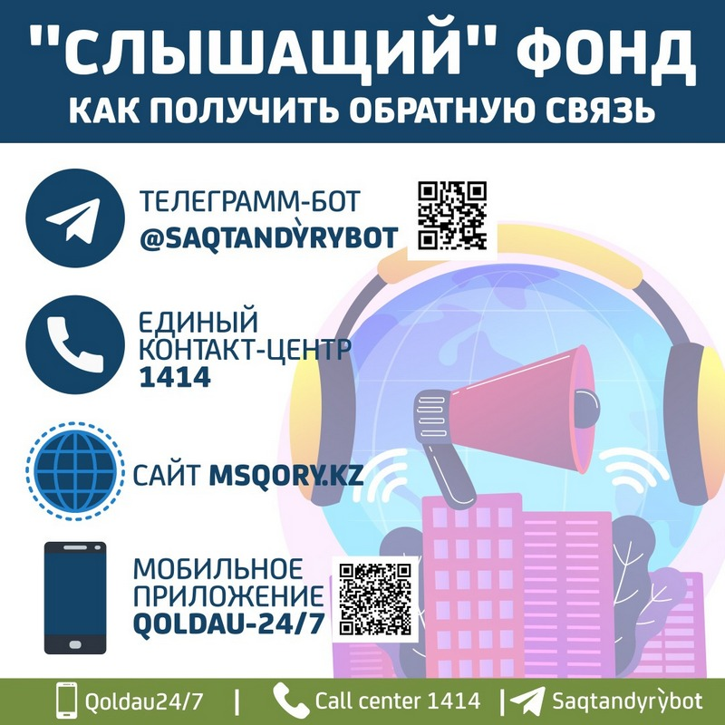

С 1 января 2020 года в Казахстане вступила в силу система обязательного медицинского страхования. 

Вы знаете, как будете получать медпомощь по страховке и что надо сделать для участия  в системе ОСМС? 
Зайдите на сайт [fms.kz](https://fms.kz) или позвоните  на бесплатный номер 1406 и узнайте подробности. 

[Порядок получения медицинской помощи](https://adilet.zan.kz/rus/docs/V1500011361)

Также можете обратиться за консультацией по ОСМС  в свою поликлинику.

### ЧТО МОЖНО ПОЛУЧИТЬ БЕСПЛАТНО – ГОБМП

В гарантированный объем бесплатной медицинской помощи входят:
* cкорая медицинская помощь, включая медицинскую авиацию;
* первичная медико-санитарная помощь, включая диагностику, лечение, профилактические осмотры, санитарно-противоэпидемические и санитарно-профилактические мероприятия в очагах инфекционных заболеваний;
* специализированная медицинская помощь в амбулаторных условиях, включая профилактику и диагностику вич-инфекции и туберкулеза, услуги при неотложных состояниях, диагностика и лечение при социально-значимых и хронических заболеваний;
* специализированная медицинская помощь в стационарозамещающих условиях, включая лечение при социально-значимых и хронических заболеваниях; услуги стационара на дому;
* специализированная медицинская помощь в стационарных условиях, включая лечение инфекционных, паразитарных заболеваний, представляющих опасность для окружающих и подозрение на них;
* обеспечение лекарственными средствами, включая медицинские изделия, иммунобиологические лекарственные препараты при оказании скорой и специализированной помощи ПМСП в соответствии с перечнем заболеваний, против которых проводятся профилактические прививки и специализированной медицинской помощи в амбулаторных условиях.

### ЧТО МОЖНО ПОЛУЧИТЬ БЕСПЛАТНО – ОСМС

Люди, имеющие статус застрахованности в системе ОСМС, получают расширенный доступ к медицинской помощи обязательного социального медицинского страхования.

В ОСМС входят следующие медицинские услуги:
* профилактические медицинские осмотры;
* прием и консультации врачей узкого профиля по направлению участкового врача;
* динамическое наблюдение профильными специалистами лиц с хроническими заболеваниями;
* оказание стоматологической помощи в экстренной и плановой форме отдельным категориям населения;
* диагностические услуги, в том числе лабораторная диагностика (УЗИ, рентген, КТ, МРТ);
* специализированная, в том числе высокотехнологичная, стационарная медицинская помощь;
* медицинская реабилитация;
* обеспечение лекарственными средствами, при оказании специализированной медицинской помощи в стационарных условиях.